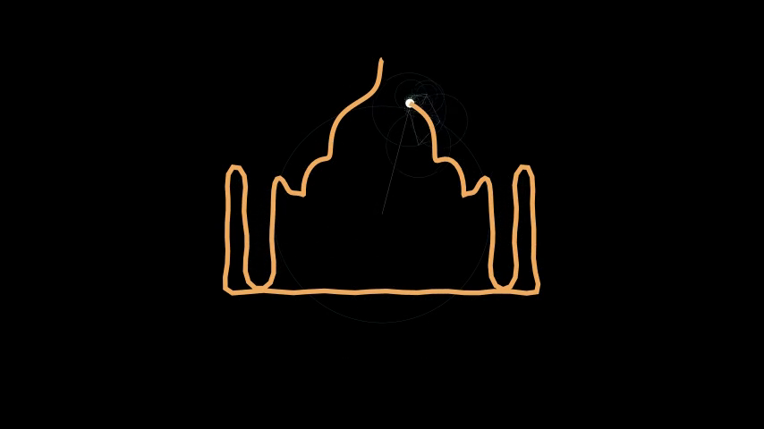

# Manim Workshop

> **From one circle to Fourier epicycles tracing a photograph.**
> A hands-on, single-session workshop for [Manim Community Edition](https://www.manim.community/):
> the Python library behind 3Blue1Brown-style mathematical animation.

[](../../actions/workflows/ci.yml)


You do not need to know Manim to start, and you do not need to be a
mathematician to finish. You need Python 3.11+, 20 minutes of setup, and the
willingness to type code slightly wrong the first time.

---

## What you will build

Seven stages, each one small enough to absorb in a sitting, each one adding one
idea. By the end you will have animated *Doraemon's silhouette out of 61
rotating circles* — the Fourier epicycle trick from 3Blue1Brown's
*"But what is a Fourier series?"* — using your own image if you like.

| Stage | The idea | Scenes | Notes |
|:--|:--|:--|:--|
| **01** basics | `Create`, `.animate`, colours and fills | `HelloCircle`, `FilledCircle` | [concepts/01](docs/concepts/01-mobjects-and-animations.md) |
| **02** transforms | one shape becomes another (`Transform`) | `SquareToCircle` | [concepts/03](docs/concepts/03-transforms.md) |
| **03** positioning | layout with `next_to` before animating | `CircleAndSquare` | [concepts/01](docs/concepts/01-mobjects-and-animations.md) |
| **04** groups & rotation | `VGroup`, `Rotate(about_point=…)`, `TracedPath`, updaters | `CircleAndSquareRotating`, `CircleAndSquareRotatingWithTracing`, `CircleAndCircleRotating`, `CircleAndCircleMoving`, `CircleAndDotRotatingAndTracing` | [concepts/04](docs/concepts/04-groups-and-rotation.md), [05](docs/concepts/05-updaters-and-tracing.md) |
| **05** parametric curves | a `ValueTracker` as the time axis; `always_redraw` | `SineSnake`, `Epicycloid`, `LissajousFigures`, `RoseCurve` | [concepts/06](docs/concepts/06-parametric-curves.md) |
| **06** flowers | segments, loops, gradients, rotating the result | `FlowerWithColors`, `RotatingFlower`, `FlowerWithGradient` | [concepts/06](docs/concepts/06-parametric-curves.md) |
| **07** the finale | the DFT of an image outline → epicycles | `FourierEpicycle` | [concepts/07](docs/concepts/07-fourier-epicycles.md) |



*Frame from `FourierEpicycle` — the whole gallery is generated from real renders:
[`docs/gallery/`](docs/gallery/).*

---

## Quickstart

Three ways in. Pick one; they all end at the same place.

### Option A — `uv` (fastest)

```bash
git clone https://github.com/alok2006/Manim_Workshop.git
cd Manim_Workshop

uv venv --python 3.13          # create the virtual environment
source .venv/bin/activate      # Windows: .venv\Scripts\activate
uv pip install -r requirements.txt
uv pip install -e .            # makes `manim_workshop` importable
```

### Option B — `venv` + `pip` (no extra tools)

```bash
git clone https://github.com/alok2006/Manim_Workshop.git
cd Manim_Workshop

python3 -m venv .venv          # create the virtual environment
source .venv/bin/activate      # Windows: .venv\Scripts\activate
python -m pip install --upgrade pip
pip install -r requirements.txt
pip install -e .
```

### Option C — conda

```bash
conda create -n manim-workshop python=3.13 -y
conda activate manim-workshop
pip install -r requirements.txt
pip install -e .
```

> **Linux users:** Manim needs system libraries *before* `pip install` can work.
> On Debian/Ubuntu:
> `sudo apt-get install -y build-essential ffmpeg libcairo2-dev libpango1.0-dev pkg-config`
> Full per-OS instructions: [`docs/01-getting-started.md`](docs/01-getting-started.md).

### Then render your first scene

```bash
manim render -ql scenes/01_basics.py HelloCircle
```

You should see a progress bar, then:

```
INFO     Rendered HelloCircle
File ready at .../media/videos/01_basics/480p15/HelloCircle.mp4
```

`-ql` is "quality: low" (854×480 @ 15 fps) — the right choice while the
animation still takes two seconds instead of two hours.

### And check that *everything* is healthy

```bash
python scripts/check_scenes.py --dry-run    # runs all 17 scenes, writes no video
```

---

## Repository layout

```
Manim_Workshop/
├── scenes/                  # the workshop itself, in teaching order
│   ├── 01_basics.py             HelloCircle · FilledCircle
│   ├── 02_transforms.py         SquareToCircle
│   ├── 03_positioning.py        CircleAndSquare
│   ├── 04_groups_and_rotation.py  (5 scenes)
│   ├── 05_parametric_curves.py    SineSnake · Epicycloid · LissajousFigures · RoseCurve
│   ├── 06_flowers.py              FlowerWithColors · RotatingFlower · FlowerWithGradient
│   └── 07_fourier_epicycle.py     FourierEpicycle
├── manim_workshop/          # shared Python helpers (installed with `pip install -e .`)
│   ├── fourier.py               contour extraction + DFT (the finale's maths)
│   ├── catalog.py               AST discovery of the scenes
│   ├── runner.py                portable `manim render` invocation
│   └── paths.py                 repo paths + asset resolution
├── notebooks/workshop.ipynb # the original teaching notebook (cells ↔ scenes)
├── assets/doraemon.jpg      # the silhouette the finale traces
├── docs/                    # written notes for every concept
├── scripts/                 # check_scenes.py, make_gallery.py
├── tests/                   # pytest suite (fast + one real render)
└── media/                   # render output (git-ignored)
```

---

## Running things

| I want to… | Command |
|:--|:--|
| render one scene | `manim render -ql scenes/05_parametric_curves.py RoseCurve` |
| render a whole stage | `manim render -ql -a scenes/06_flowers.py` |
| render all 17 scenes | `python scripts/check_scenes.py --render` (or `make render`) |
| verify everything compiles | `python scripts/check_scenes.py --dry-run` |
| check one scene only | `python scripts/check_scenes.py --dry-run --only RoseCurve` |
| list every scene + command | `python scripts/check_scenes.py --list` |
| a nicer quality for slides | `manim render -qh scenes/07_fourier_epicycle.py FourierEpicycle` |
| a shareable GIF | `manim render -ql --format gif scenes/05_parametric_curves.py SineSnake` |
| regenerate the doc stills | `python scripts/make_gallery.py` |
| run the tests | `pytest` (or `make test`) |
| open the notebook | `jupyter lab notebooks/workshop.ipynb` |

Quality flags: `-ql` 854×480@15 · `-qm` 1280×720@30 · `-qh` 1920×1080@60 ·
`-qp` 2560×1440@60 · `-qk` 3840×2160@60.
Details, caching and where files land: [`docs/04-rendering-guide.md`](docs/04-rendering-guide.md).

---

## Documentation

| Document | What it answers |
|:--|:--|
| [01 — Getting started](docs/01-getting-started.md) | how to install, per OS, and how to verify the install |
| [02 — Workshop outline](docs/02-workshop-outline.md) | the teaching plan, timings, instructor notes |
| [03 — Scene catalog](docs/03-scene-catalog.md) | every scene: what it teaches, its API, how to run it, old↔new names |
| [04 — Rendering guide](docs/04-rendering-guide.md) | qualities, formats, output layout, caching, run times |
| [05 — Troubleshooting](docs/05-troubleshooting.md) | error → cause → fix, including install failures per OS |
| [concepts/](docs/concepts/) | seven concept notes: mobjects, rate functions, transforms, groups, updaters, curves, Fourier |
| [notebooks/workshop.ipynb](notebooks/workshop.ipynb) | the same 17 scenes as executable cells, in order |

Every scene in `scenes/` is documented; a test enforces it, so the catalog
cannot silently drift away from the code.

---

## How this repo is kept honest

| Guard | What it catches |
|:--|:--|
| `scripts/check_scenes.py` | missing docstrings, duplicate names, a scene that no longer runs |
| `pytest` (95 tests) | catalogue invariants, docs↔code drift, broken relative links, the DFT maths, notebook↔scene drift, plus one real render and a full notebook execution |
| `.github/workflows/ci.yml` | all of the above on every push, on Python 3.13 and 3.14 |
| `pyrightconfig.json` | type checking on the library code (scenes are excluded — see [CONTRIBUTING](CONTRIBUTING.md#why-are-the-scenes-not-type-checked)) |

---

## Requirements

* **Python** 3.11 – 3.14 (3.13 recommended; the pinned versions were recorded on 3.14)
* **Manim CE** 0.21.0 (pinned in `requirements.txt`; the full transitive snapshot is in `requirements-lock.txt`)
* **OpenCV** (via `opencv-python`) — only the finale needs it
* **ffmpeg** — Manim shells out to it to encode video
* No LaTeX distribution is required: none of these scenes typeset maths

---

## Credits and licence

Workshop authored by [@alok2006](https://github.com/alok2006);
the scene code grew out of the original `Notebook.ipynb` in this repository.
Built with [Manim Community Edition](https://www.manim.community/).

**No licence file is included yet**, so this repository is "all rights
reserved" by default. If you intend to reuse it — for a course, a fork, a
blog post — please open an issue and ask the author to add one (MIT or
CC-BY-4.0 are the usual choices for teaching material).
