# 03 — Scene catalog

Every scene in the repository: what it teaches, which Manim APIs it uses, how to
run it, and what it should look like. Stills come from
[`gallery/`](gallery/), which is generated from real renders.

**Run any scene on this page with the command shown in its heading.** For
qualities, formats and output paths see the [rendering guide](04-rendering-guide.md).

| Stage | File | Scenes |
|:--|:--|:--|
| 01 basics | [`scenes/01_basics.py`](../scenes/01_basics.py) | `HelloCircle`, `FilledCircle` |
| 02 transforms | [`scenes/02_transforms.py`](../scenes/02_transforms.py) | `SquareToCircle` |
| 03 positioning | [`scenes/03_positioning.py`](../scenes/03_positioning.py) | `CircleAndSquare` |
| 04 groups & rotation | [`scenes/04_groups_and_rotation.py`](../scenes/04_groups_and_rotation.py) | `CircleAndSquareRotating`, `CircleAndSquareRotatingWithTracing`, `CircleAndCircleRotating`, `CircleAndCircleMoving`, `CircleAndDotRotatingAndTracing` |
| 05 parametric curves | [`scenes/05_parametric_curves.py`](../scenes/05_parametric_curves.py) | `SineSnake`, `Epicycloid`, `LissajousFigures`, `RoseCurve` |
| 06 flowers | [`scenes/06_flowers.py`](../scenes/06_flowers.py) | `FlowerWithColors`, `RotatingFlower`, `FlowerWithGradient` |
| 07 fourier epicycle | [`scenes/07_fourier_epicycle.py`](../scenes/07_fourier_epicycle.py) | `FourierEpicycle` |

---

## Stage 1 — Basics

*Two ideas carry you a long way: `Create` draws a mobject, and `.animate`
interpolates any property you can set.*

### `HelloCircle`

```bash
manim render -ql scenes/01_basics.py HelloCircle
```

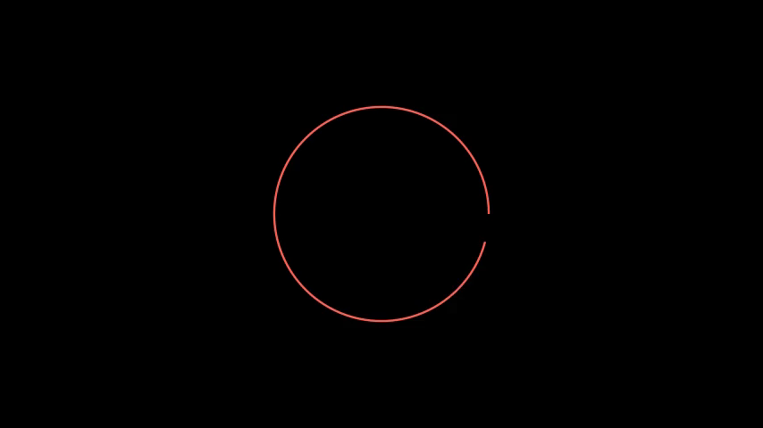

| | |
|:--|:--|
| **Teaches** | `Circle`, `Create`, `run_time`, `rate_func` |
| **Notable** | `rate_functions.ease_in_out_circ` makes the draw start and end gently — compare with the default `smooth` |
| **Watch for** | `Circle()` is red by default in Manim; pass `color=` rather than being surprised later |

### `FilledCircle`

```bash
manim render -ql scenes/01_basics.py FilledCircle
```

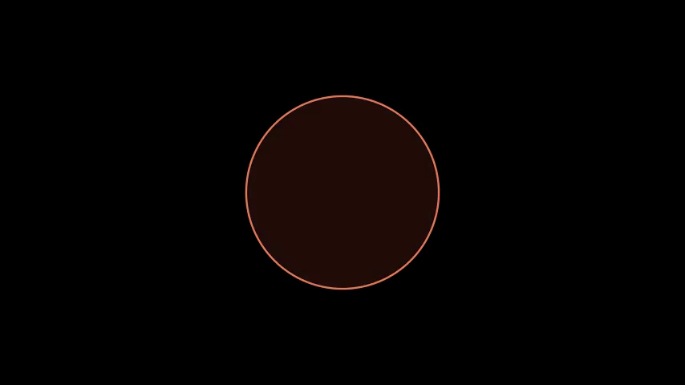

| | |
|:--|:--|
| **Teaches** | `.animate`, `set_color`, `set_fill(opacity=…)` |
| **Notable** | a fill without an explicit `opacity` is invisible — `0.0` is the default |
| **Try** | replace the first `play` with `self.add(circle)` and watch the difference between *appearing* and *being drawn* |

---

## Stage 2 — Transforms

### `SquareToCircle`

```bash
manim render -ql scenes/02_transforms.py SquareToCircle
```

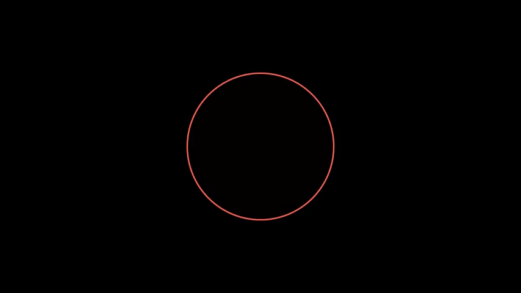

| | |
|:--|:--|
| **Teaches** | `Square`, `rotate`, `Transform` |
| **Notable** | after `Transform(square, circle)` you must keep animating **`square`** — that is the mobject on screen; `circle` was only a template |
| **Watch for** | the result is red, not green: `Transform` adopts the target's colour, and `Circle()` defaults to red. Full explanation in [concepts/03](concepts/03-transforms.md#gotcha-why-is-my-circle-red) |

---

## Stage 3 — Positioning

### `CircleAndSquare`

```bash
manim render -ql scenes/03_positioning.py CircleAndSquare
```

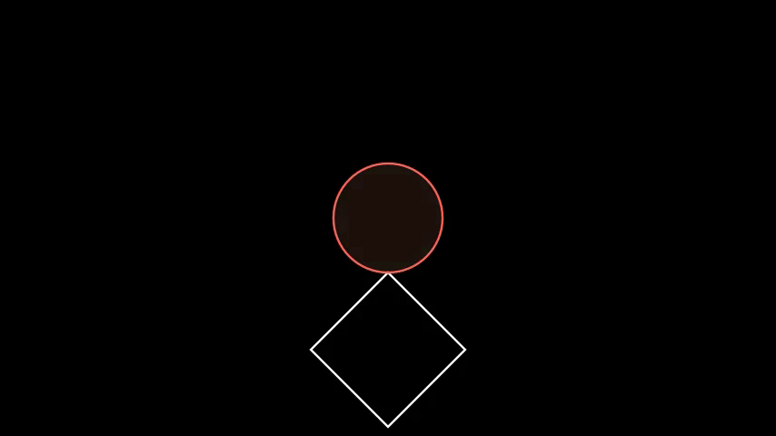

| | |
|:--|:--|
| **Teaches** | `next_to(mob, direction, buff=…)`, `DOWN`, draw order |
| **Notable** | `buff=0` makes the two shapes touch exactly |
| **Habit worth keeping** | get the layout right before animating anything |

---

## Stage 4 — Groups, rotation, motion and tracing

### `CircleAndSquareRotating`

```bash
manim render -ql scenes/04_groups_and_rotation.py CircleAndSquareRotating
```

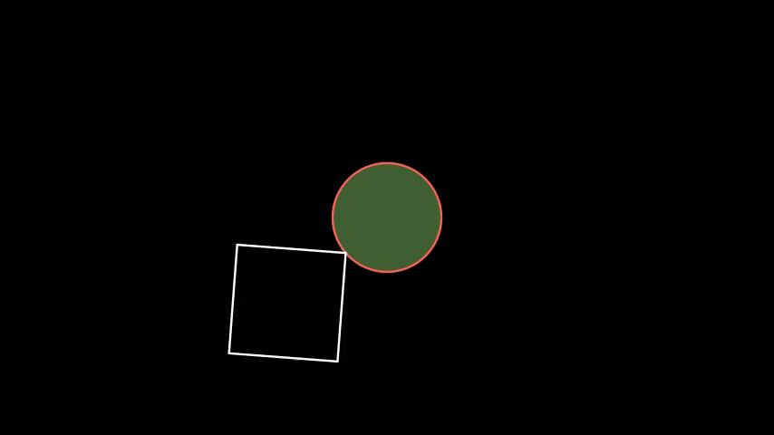

| | |
|:--|:--|
| **Teaches** | `VGroup`, `Rotate(angle=…, about_point=ORIGIN, axis=OUT)` |
| **Notable** | `Create(group)` draws every member of the group in one call |

### `CircleAndSquareRotatingWithTracing`

```bash
manim render -ql scenes/04_groups_and_rotation.py CircleAndSquareRotatingWithTracing
```

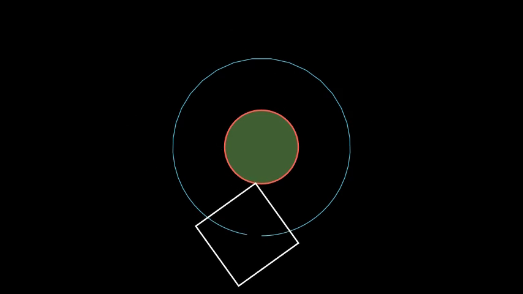

| | |
|:--|:--|
| **Teaches** | `TracedPath(mob.get_center, stroke_color=…, stroke_width=…)` |
| **Notable** | add the path *before* the motion so it renders behind everything else |
| **Watch for** | the trail is the *square's centre*, which is why it traces a circle |

### `CircleAndCircleRotating`

```bash
manim render -ql scenes/04_groups_and_rotation.py CircleAndCircleRotating
```

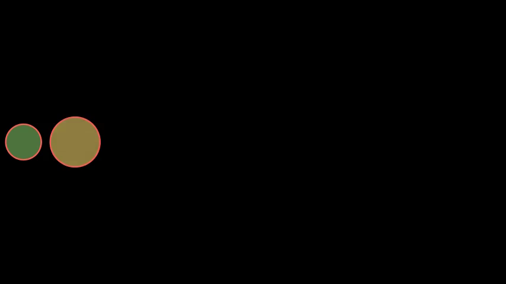

| | |
|:--|:--|
| **Teaches** | `about_point` as the difference between "a rotation" and "an orbit" |
| **Notable** | the whole group spins around the *second circle's centre* |
| **Old name** | `CircleAndCircleRotatingAndMoved` (it rotates; it never moved) |

### `CircleAndCircleMoving`

```bash
manim render -ql scenes/04_groups_and_rotation.py CircleAndCircleMoving
```

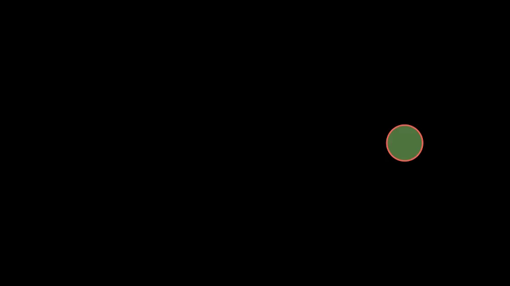

| | |
|:--|:--|
| **Teaches** | `mob.animate.move_to(point)` vs `shift` (absolute vs relative) |
| **Notable** | the group keeps its internal layout while its centre travels |

### `CircleAndDotRotatingAndTracing`

```bash
manim render -ql scenes/04_groups_and_rotation.py CircleAndDotRotatingAndTracing
```

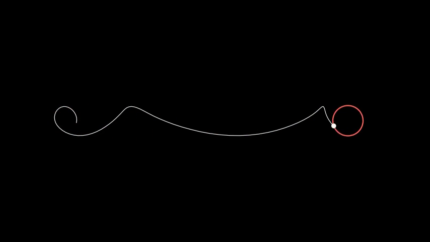

| | |
|:--|:--|
| **Teaches** | `add_updater(lambda mob, dt: …)` — code that runs every frame |
| **Notable** | rotation (updater) and translation (`.animate`) overlap, so the traced path is a compounded curve — a cycloid |
| **Watch for** | updaters keep running until you call `clear_updaters()` |

---

## Stage 5 — Parametric curves

*Every scene here has the same skeleton: a `ValueTracker` is the time axis, a dot
is recomputed from it with `always_redraw`, and a `TracedPath` inks in where the
dot has been.*

### `SineSnake`

```bash
manim render -ql scenes/05_parametric_curves.py SineSnake
```


| | |
|:--|:--|
| **Teaches** | `ValueTracker`, `always_redraw`, `dissipating_time` |
| **Notable** | `dissipating_time=1.5` gives the comet-tail effect; `None` keeps everything |

### `Epicycloid`

```bash
manim render -ql scenes/05_parametric_curves.py Epicycloid
```

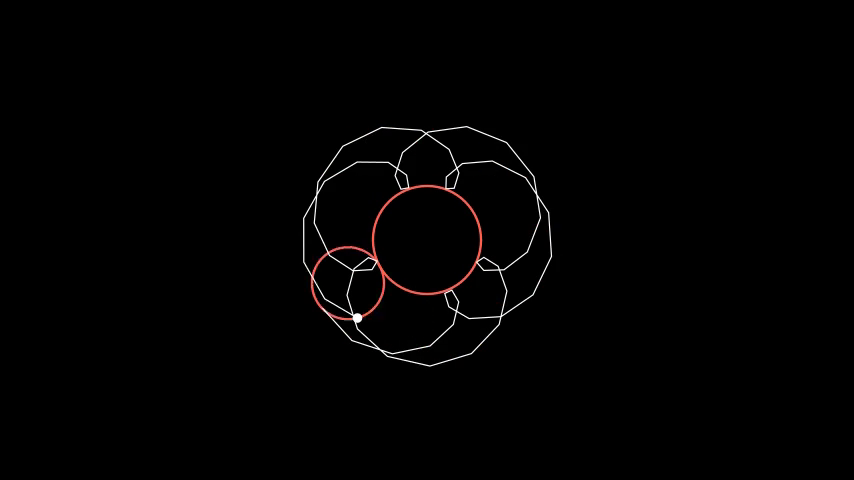

| | |
|:--|:--|
| **Teaches** | two independent rotation rates combining |
| **Notable** | `f1` orbits the small wheel, `f2` spins the pen — their ratio is the entire design space |
| **Old name** | `EpiCycloids` |

### `LissajousFigures`

```bash
manim render -ql scenes/05_parametric_curves.py LissajousFigures
```

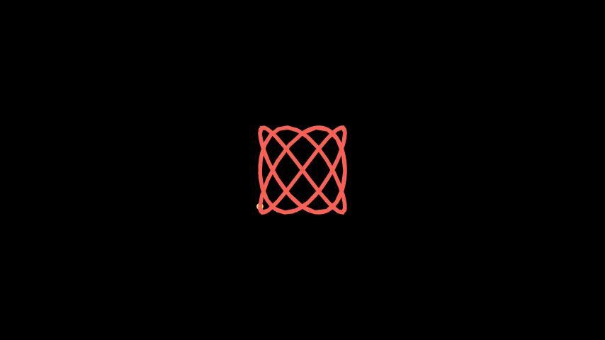

| | |
|:--|:--|
| **Teaches** | two functions of the same parameter, one per axis |
| **Try** | `w1, w2 = 3, 5` then `phi = 0` — rational ratios close the curve, irrational ones never do |

### `RoseCurve`

```bash
manim render -ql scenes/05_parametric_curves.py RoseCurve
```

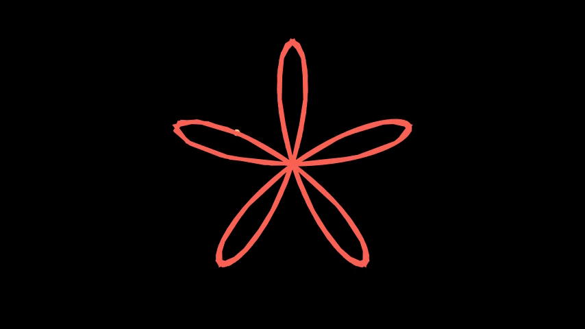

| | |
|:--|:--|
| **Teaches** | polar → Cartesian: `(r·cos θ, r·sin θ)` |
| **Notable** | `k` is the petal count for odd `k` |
| **Old name** | `MyRose` |

---

## Stage 6 — Flowers (the projects)

### `FlowerWithColors`

```bash
manim render -ql scenes/06_flowers.py FlowerWithColors
```

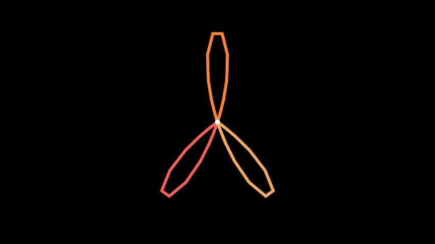

| | |
|:--|:--|
| **Teaches** | segments, `for` loops over petals, one `TracedPath` per colour |
| **Notable** | `time_period = PI/k` for odd `k`, `2*PI/k` for even — that is what makes the petals close cleanly |
| **Old name** | `MyFlowerWIthColors` |

### `RotatingFlower`

```bash
manim render -ql scenes/06_flowers.py RotatingFlower
```

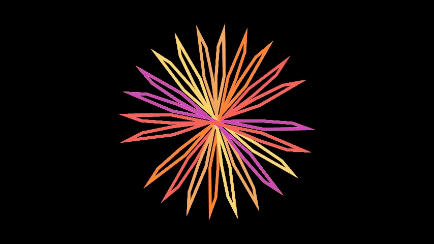

| | |
|:--|:--|
| **Teaches** | collecting geometry into a `VGroup` and discarding the machinery that drew it |
| **Notable** | `VMobject(…).set_points(segment.get_points())` clones a traced path with no updaters attached |
| **Old name** | `MyRotatingFlower` |

### `FlowerWithGradient`

```bash
manim render -ql scenes/06_flowers.py FlowerWithGradient
```


| | |
|:--|:--|
| **Teaches** | gradient strokes: `stroke_color=[c1, c2]` interpolates along the stroke |
| **Notable** | handing petal `x` the pair `(colors[x], colors[x+1])` makes the palette cycle smoothly |
| **Old name** | `MyFlowerWithGradientEffect` |

---

## Stage 7 — The finale

### `FourierEpicycle`

```bash
manim render -ql scenes/07_fourier_epicycle.py FourierEpicycle
manim render -qh scenes/07_fourier_epicycle.py FourierEpicycle   # 1080p60, ~2 min
```


| | |
|:--|:--|
| **Teaches** | the DFT of an image outline, tip-to-tail vector addition, `always_redraw` for recompute-everything scenes |
| **Notable** | 61 coefficients (`n = -30 … 30`) sorted by radius: the coarse shape lands first, detail last |
| **Data** | `assets/doraemon.jpg` → contour → 300 samples → 61 circles |
| **Old name** | `MyFourierEpicyle` |
| **Maths** | [concepts/07 — Fourier epicycles](concepts/07-fourier-epicycles.md) |

**Point it at your own drawing.** The extractor expects a **dark subject on a
light background** (that is what `doraemon.jpg` is). Give it a light subject on a
dark background and it refuses with an explanation instead of quietly tracing the
image border — a failure mode that was found by testing and is now guarded:

```python
from manim_workshop.fourier import get_fourier_coefficients
coeffs = get_fourier_coefficients("assets/my_silhouette.png", num_coeffs=200)
```

---

## Renamed scenes (migration table)

The original notebook's class names had accumulated typos (`Sqaure`, `cirlce`,
`Epicyle`, `MyRose`…). When the notebook was split into modules they were
normalised, so anyone holding older slides needs a lookup:

| Old name (notebook) | New name (scenes/) | Why |
|:--|:--|:--|
| `aCircle` | `HelloCircle` | descriptive, matches the "Hello World" cell above it |
| `aFilledCircle` | `FilledCircle` | drop the article |
| `ConvertSqtoCircle` | `SquareToCircle` | spelling |
| `CircleAndSqaure` | `CircleAndSquare` | spelling |
| `CircleAndSqaureRotating` | `CircleAndSquareRotating` | spelling |
| `CircleAndSqaureRotatingWithTracing` | `CircleAndSquareRotatingWithTracing` | spelling |
| `CircleAndCircleRotatingAndMoved` | `CircleAndCircleRotating` | it rotates; it never moved |
| `CircleAndCircleMoving` | `CircleAndCircleMoving` | unchanged |
| `CircleAndDotRotatingMovingANDTracing` | `CircleAndDotRotatingAndTracing` | shouting + grammar |
| `Snake` | `SineSnake` | says what it draws |
| `EpiCycloids` | `Epicycloid` | singular |
| `LissajousFigures` | `LissajousFigures` | unchanged |
| `MyRose` | `RoseCurve` | `My…` is not a namespace |
| `MyFlowerWIthColors` | `FlowerWithColors` | capitalisation |
| `MyRotatingFlower` | `RotatingFlower` | `My…` |
| `MyFlowerWithGradientEffect` | `FlowerWithGradient` | `My…` + redundant "Effect" |
| `MyFourierEpicyle` | `FourierEpicycle` | spelling |

The map is machine-readable (`manim_workshop.catalog.LEGACY_SCENE_NAMES`) and
tested, so it cannot drift: `pytest tests/test_scene_catalog.py`.

## Keeping this page honest

`tests/test_docs.py` fails if a scene exists in `scenes/` but is missing from
this catalog, if a documented command points at a scene that does not exist, or
if a relative link in `docs/` is broken. Documentation that cannot rot is worth
the ninety lines it costs.
